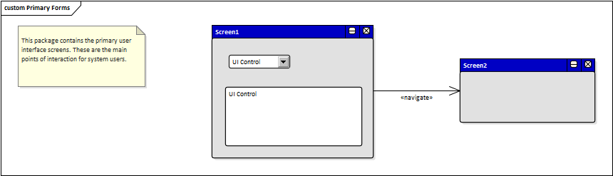

# Documento de Visão do Projeto "NOME DO PROJETO"

Este documento apresenta uma solução de software para o projeto *GESTÃO DA INOVAÇÃO*, solicitado pelo cliente *BANCO DO BRASIL*, 
apresentando os problemas a serem solucionados, as necessidades dos principais envolvidos, o alcance do projeto e as funcionalidades 
esperadas do sistema.

## Objetivos

* Aumento de Produtividade
* Fomentar o Processo de Inovação
* Interações junto às comunidades de inovação
* Possibilitar a maturação e seleção de ideias por meio de estágios, perfazendo o funil da inovação. 
* Possibilitar o acompanhamento da ideia nos seus diversos estágios de maturação
* Fornecer visões do processo
* Possibilitar a administração do sistema por meio de interface própria para gestão de acesso

## Problema

* Descrição do problema: Tornar a Gestão de processos inovativos mais eficiente e menos custosa
* Quem é afetado pelo problema: Público Interno do Banco do Brasil.
* Impacto no negócio: Redução de custos, aumento na eficiência e 
* Benefícios de uma boa solução: Aumento da produtividade e eficiência de processos inovatórios e incentivar comportamentos proativos dentro da instituição

## Definições, abreviações e outros termos do domínio do problema

* RFP - Request for Proposal 
* Gamification  - estratégia de interação entre pessoas e empresas com base no oferecimento de incentivos que estimulem o engajamento do público com as marcas de maneira lúdica

## Integração com outros sistemas

* Sistema de cadastro de funcionários do Banco do Brasil

 
## Interessados

* Gestor de Inovação
* Recursos Humanos
* Setor Financeiro

## Usuários

* Gestor
* Administrador do Sistema
* Funcionários
* etc.

## Funcionalidades do produto

* Acúmulo de pontos
* Dashboard de atividades
* Post de ideias
* Possibilidade de se voluntariar para projetos
* Timeline dos estágios das ideias
* Área de feedback
* Área de sugestões
* Rankeamento

## Restrições do projeto

* Apenas funcionários do Banco do Brasil tem acesso
* Apenas o Gestor tem acesso à concessão de permissões de visualização
* Funcionários que não estejam em um projeto já iniciado, não podem visualizar status

## Protótipos de tela

### Protótipos para funcionalidade 1

Fonte: Exemplos gerados pelo assistente do **Enterprise Architect**.

### Protótipos para funcionalidade 2

Fonte: Exemplos gerados pelo assistente do **Enterprise Architect**.

### Protótipos para funcionalidade N
